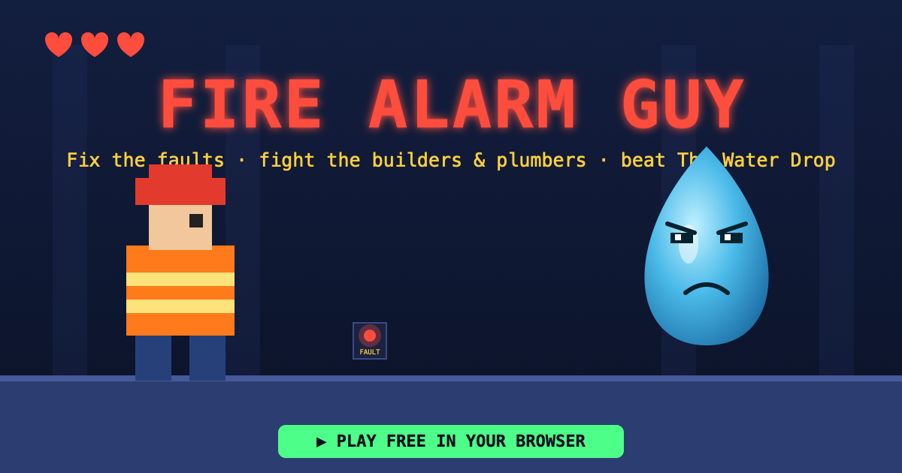

# 🔥 Fire Alarm Guy

A free, single-file browser platformer. You play an imaginary **fire alarm engineer** who
moves through a building fixing faults, fighting **builders, plumbers, painters and
electricians**, and finally facing the boss of all alarm enemies — **The Water Drop**.

**▶ [Play it](https://dn8pmm4hyp-create.github.io/fire-alarm-guy/)**

## One-click apps (macOS)

No terminal needed — just double-click from Finder:

- **`▶ Play.command`** — opens the game in your browser.
- **`🔗 Share.command`** — publishes the game to GitHub Pages and copies a shareable
  link to your clipboard. The first time, it signs you into GitHub and creates the repo;
  every run after that just uploads your latest version. (Requires the `gh` CLI.)

> First launch: macOS may ask permission for Terminal to run the script — click **OK**.
> If a `.command` won't open, right-click it → **Open** once to approve it.

## How to play

| Key | Action |
|-----|--------|
| ← → | Move |
| ↑ / Space | Jump (press again in mid-air to **double-jump**) |
| C / Shift | Dash (brief invincibility) |
| X | Swing wrench (melee) |
| Z | Throw screwdriver (ranged) |
| E | Fix a fault while standing on the panel |
| P | Pause &nbsp;·&nbsp; M | Mute &nbsp;·&nbsp; Enter | Start / restart |

On phones, on-screen touch controls appear automatically. **iPhone sound:** tap once to
start (iOS requires a tap before audio), flip the side **Ring/Silent switch up**, and turn
the volume up — then you'll hear the alarm sounder, PA announcement, music and effects.
Turn the phone **sideways (landscape)** for the best, full-screen view. Add it to your Home
Screen for a fullscreen, app-like experience.

**Goal:** Each floor's exit stays **locked** until you fix every blinking **FAULT** panel.
Fix them all, reach the exit, and on the final floor — defeat The Water Drop, which
**enrages at half health** and unleashes a telegraphed tidal wave.

Grab **bolts** for points, chain kills and pickups for a **combo multiplier**, and collect
**❤ health**, **◊ shield**, and **» rapid-fire** power-ups. Your best score is saved locally.

## Sound

The game synthesizes a looping **fire-alarm sounder** and speaks a **PA evacuation
announcement** ("…due to a reported emergency, please evacuate the station immediately")
using your browser's text-to-speech, plus light chiptune music and effects. Click the game
or press a key first — browsers require one interaction before audio can play. Press **M** to mute.

## Running locally

It's one self-contained file with no dependencies or build step. Either:

- **Double-click** `index.html` to open it in your browser, or
- Serve the folder: `python3 -m http.server 8000` then visit <http://localhost:8000>.

## Tech

Plain HTML + Canvas 2D + the Web Audio and SpeechSynthesis APIs. No frameworks, no assets —
everything (sprites, sounds, the cover art) is generated in code. `cover.svg` is the source
for `cover.png`.

---

Made for fun. 🔥
